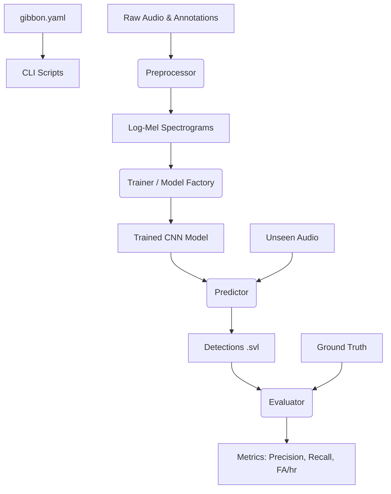

# BioAcoustica

### A Modular, Species-Agnostic Framework for Scalable Bioacoustic Monitoring

BioAcoustica is a high-quality, open-source framework designed to simplify the pipeline for bioacoustic detection and surveillance. Whether you are monitoring animal species in a rainforest, BioAcoustica provides the tools to process audio, train deep learning models, and evaluate performance with research-grade rigor.

## 🚀 Pipeline Architecture

BioAcoustica follows a modular architecture driven by **YAML configurations**.



## 🛠️ Features

- **YAML Config Driven**: Centralize species parameters in a single file — sample rate, class labels, model architecture.
- **Species Agnostic**: Fully configurable for any sound class.
- **Model Factory**: Switch architectures with one line — `CustomCNN`, `MobileNetV2`, or `EfficientNetB0`.
- **Robust Feature Extraction**: Log-Mel spectrogram generation with lowpass filtering, downsampling, and augmentation.
- **Research-Grade Evaluation**: Event merging, absolute-timestamp matching, and a 50% overlap threshold for strict TP classification.
- **CLI Ready**: Full pipeline executable from the terminal with `--config`.

## 📁 Project Structure

```text
/configs            # Species-specific YAML configs (e.g., gibbon.yaml)
/data
  /raw/audio        # Raw .wav files
  /raw/annotations  # .svl / .txt annotations (Sonic Visualiser / Raven)
  /metadata         # TrainingFiles.txt, TestingFiles.txt
  /processed        # Extracted features (X.pkl, Y.pkl)
/src/bioacoustica   # Core framework package
  /data             # Preprocessor, AnnotationReader
  /training         # Trainer, DataManager, Networks (Model Factory)
  /testing          # Predictor, Evaluator
/cli                # Command-line interface scripts
/notebooks/tutorials # Step-by-step guides (01–03)
```

## ⚡ Quick Start

### 1. Setup Environment
```bash
# Activate the virtual environment
source venv/bin/activate

# Install dependencies
pip install -r requirements.txt

# Or install as a package (src layout)
pip install -e .
```
> [!TIP]
> Use the **"Python 3 (BioAcoustica)"** kernel when running Jupyter Notebooks.

### 2. Preprocess Data
Use `--file_list` to enforce strict training/testing splits:
```bash
python cli/preprocess.py --config configs/gibbon.yaml \
    --file_list data/metadata/TrainingFiles.txt \
    --output_dir data/processed
```

### 3. Train Model
Choose your architecture by setting `architecture` in the config:
```bash
python cli/train.py --config configs/gibbon.yaml

# Or override architecture from the CLI:
python cli/train.py --config configs/gibbon.yaml --arch efficientnet_b0 --fine_tune
```

| Architecture | `--arch` flag | Best For |
|---|---|---|
| Custom CNN | `custom_cnn` | Low resources, fast training, 1-channel spectrograms |
| MobileNetV2 | `mobilenet_v2` | Edge deployment, speed/accuracy balance |
| EfficientNetB0 | `efficientnet_b0` | Maximizing accuracy with efficient compute |

### 4. Run Inference & Evaluation
```bash
# Inference
python cli/predict.py --config configs/gibbon.yaml \
    --model_path models/custom_cnn_best.h5 \
    --file_list data/metadata/TestingFiles.txt

# Evaluation (strict — only reads files listed in TestingFiles.txt)
python cli/evaluate.py --config configs/gibbon.yaml \
    --file_list data/metadata/TestingFiles.txt
```

## 📊 Research Metrics

Validated on a strict, isolated 2-file test set (~3.18 hours of audio):

| Metric | Value |
|---|---|
| Precision | 78.46% |
| Recall | 81.46% |
| F1-Score | 79.93% |
| False Alarms / Hr | 8.80 |
| Analyzed Hours | 3.18 |

> [!NOTE]
> Evaluation uses **50% overlap matching** and **absolute timestamp alignment** across all files to prevent cross-file leakage.

## 🛠️ Technical Details

- **Model Factory**: `get_model()` in `networks.py` is the single entry point for all architectures. Pre-trained models auto-convert 1-channel grayscale inputs to 3-channel RGB.
- **Robust Augmentation**: `DataManager` balances classes with time-shifting and adds 20% variance injection to prevent overfitting.
- **EarlyStopping**: Training stops at optimal validation loss and restores the best weights automatically.
- **Strict Isolation**: `TrainingFiles.txt` and `TestingFiles.txt` guarantee zero data leakage. Commented-out lines (`#`) are ignored in both.

## 📚 Tutorials

Check out our [tutorial series](notebooks/tutorials/) to get up and running:
- `01_feature_extraction.ipynb`: Configuration and Log-Mel spectrogram generation.
- `02_model_training.ipynb`: Training with the Model Factory and YAML hyperparameters.
- `03_inference_and_evaluation.ipynb`: Running predictions and research-grade evaluation.

## 📄 License

This project is licensed under the MIT License — see the [LICENSE](LICENSE) file for details.
