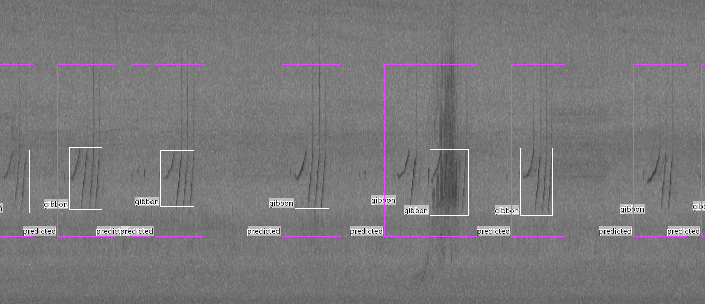

# bioacoustic-detection-pipeline

This repository provides an **end-to-end pipeline for bioacoustic species call detection** using convolutional neural networks (CNNs).  
It is designed for **weakly supervised detection**, where **only presence calls are fully annotated**, and absence is implicit. The pipeline is notebook-driven and focuses on audio preprocessing, CNN training,batch prediction, and event-based detection evaluation (PAM-oriented)

---

## 📁 Repository Structure

      bioacoustic-detection-pipeline/
      │
      ├── Audio/                  # Raw audio recordings (WAV)
      ├── Annotations/            # Ground-truth SVL files
      ├── DataFiles/              # List of file names used for training and testing
      ├── src/                   
      │   ├── data_process/       # Feature extraction, dataset creation
      │   ├── training/           # Model architecture and training scripts
      │   └── testing/            # Batch prediction and evaluation scripts
      │
      ├── notebooks/              # Demonstration notebooks
      │   ├── training_demos.ipynb
      │   └── testing_demos.ipynb
      │
      ├── requirements.txt
      ├── .gitignore
      └── README.md

---

## 🧠 Method Overview

The pipeline follows these steps:

1. Audio is segmented into short, fixed-length windows.

2. Time–frequency features (spectrograms) are extracted.

3. A CNN is trained to detect the presence of a target species.

4. The trained model is applied to longer recordings for batch prediction.

5. Predictions are evaluated using event-based metrics, which are suitable for partially annotated datasets.

---

## 📓 Notebooks (How to Use This Repo)

### Training  

- Load audio WAV files and annotations (SVL format).

- Extract spectrogram features as input (X) and labels (Y).

- Save processed datasets for training.

### Prediction

- Load trained CNN weights.

- Apply the model to multiple audio files.

- Generate predictions in the same format as ground-truth annotations.

### Evaluation  

- Compare model predictions with ground-truth annotations.

- Compute event-based metrics: Precision, Recall (True Positive Rate), F1-score, and False Alarms per Hour (FA/h).

### Example Detection

Metrics are computed at the event level, avoiding bias from unannotated absences. This visualization demonstrates how well the model identifies species calls and aligns with human annotations. White bounding boxes represented the true presence annotations from Sonic Visualiser, while the purple bounding boxes for model predictions.

---

## ⚙️ Installation

Clone the repository:

      git clone https://github.com/milanto-hery/bioacoustic-detection-pipeline.git
      cd bioacoustic-detection-pipeline

Install dependencies:

      pip install -r requirements.txt
